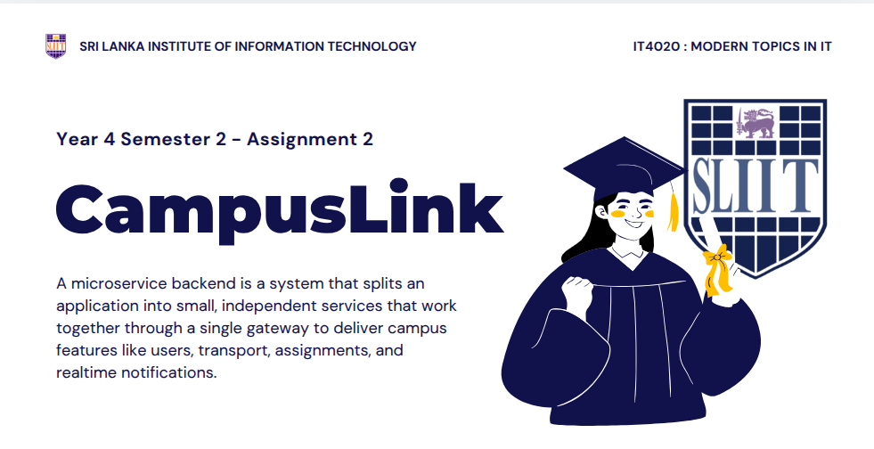

# SLIIT CampusLink (Malabe)



CampusLink is a microservices-based MVP backend for SLIIT Malabe campus operations. The repository is organized as a Node.js npm workspace with one API gateway and four domain services that cover user management, transport, assignments, and notifications.

## Overview

- API gateway for unified routing and service access
- User Service for registration, login, and profile management
- Transport Service for shuttle routes, schedules, and bookings
- Assignment Service for assignment publishing and submission tracking
- Notification Service for event-driven alerts and live SSE updates

## Service Map

| Service | Purpose | Local Port |
| --- | --- | --- |
| `gateway` | Entry point and route aggregation | `8080` |
| `user-service` | Authentication and student profile flows | `3001` |
| `transport-service` | Route, schedule, and shuttle booking management | `3002` |
| `assignment-service` | Assignment creation and submission workflows | `3003` |
| `notification-service` | Notification persistence and real-time event streaming | `3004` |

## Technology Stack

- Node.js 24.x
- Express
- SQLite via `node:sqlite`
- Swagger UI / OpenAPI 3.0.4
- Server-Sent Events for notification sync

## Quick Start

### Install dependencies

```bash
npm install
```

### Run the platform

```bash
npm run dev:all
```

### Run services individually

```bash
npm run dev:user
npm run dev:transport
npm run dev:assignment
npm run dev:notification
npm run dev:gateway
```

### Quality and verification

```bash
npm run test:all
npm run smoke
npm run lint
npm run verify:docs
```

## Demo Flow

1. Register and log in through the User Service.
2. Book a shuttle seat through the Transport Service.
3. Trigger and receive a live notification through the Notification Service.
4. Create assignments and submit work through the Assignment Service.
5. Access service documentation directly or through the gateway.

## Documentation

- [Architecture](docs/ARCHITECTURE.md)
- [API Catalog](docs/API_CATALOG.md)
- [Notification Event Contract](docs/contracts/notification-event-contract.md)
- [Screenshot Checklist](docs/SCREENSHOT_CHECKLIST.md)
